# 시스템 사용 매뉴얼
> Frontend User Guide

---

## 📋 목차

- [공통](#-공통)
  - [1. 시스템 접속](#1-시스템-접속)
  - [2. 회원가입 요청](#2-회원가입-요청)
  - [3. 로그인](#3-로그인)
- [Operator 매뉴얼](#-operator-매뉴얼)
  - [1. 미션 선택](#1-미션-선택)
  - [2. 구역 선택](#2-구역-선택)
  - [3. 로봇 선택](#3-로봇-선택)
  - [4. 메인 화면](#4-메인-화면)
  - [5. 실시간 모니터링 및 로봇조종 탭](#5-실시간-모니터링-로봇조종-탭)
- [Admin 매뉴얼](#-admin-매뉴얼)
  - [1. 미션 관리](#1-미션-관리)
  - [2. 로봇 관리](#2-로봇-관리)
  - [3. 관리자 설정](#3-관리자-설정)
  - [4. 전체 관제 대시보드](#4-전체-관제-대시보드)

---

## 🔗 공통

Operator와 Admin 모두 아래의 절차를 거쳐 시스템에 접속합니다.

### 1. 시스템 접속

브라우저 주소창에 아래 URL을 입력하여 접속합니다.

```
http://localhost:5173
```

> 📌 포트 번호는 `npm run dev` 실행 시 터미널에 표시된 번호로 접속하세요. (기본값: 5173)

### 2. 회원가입 요청

처음 사용하는 경우 관리자에게 계정 승인을 요청해야 합니다.

1. 회원가입 화면에서 아이디, 비밀번호, 이름, 전화번호, 사용자 권한을 입력합니다.
2. **[회원가입 요청]** 버튼을 클릭하면 관리자에게 승인 요청이 전송됩니다.
3. Admin의 승인 완료 후 로그인이 가능합니다.

> ⚠️ 승인 전에는 로그인이 불가합니다.

### 3. 로그인

1. 아이디와 비밀번호를 입력합니다.
2. **[로그인]** 버튼을 클릭합니다.
3. 로그인 성공 시 역할에 따라 각각의 페이지로 이동합니다.

| 역할 | 로그인 후 이동 페이지 |
|------|----------------------|
| Operator | 미션 선택 화면 |
| Admin | 미션 등록 및 관리 페이지 |

---

## 👷 Operator 매뉴얼

Operator는 현장에서 로봇을 운용하고 미션을 수행하는 역할입니다.  
로그인 후 미션 선택 화면부터 시작합니다.

### 1. 미션 선택

1. 로그인 후 미션 목록이 표시됩니다.
2. 수행할 미션을 선택합니다

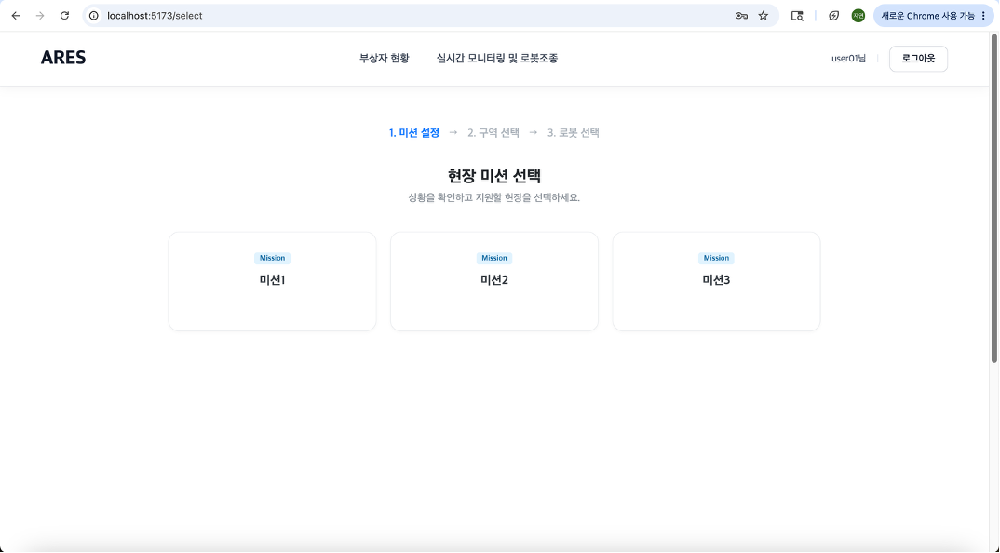

### 2. 구역 선택

1. 선택한 미션에 해당하는 구역 목록이 표시됩니다.
2. 작업을 진행할 구역을 선택합니다.

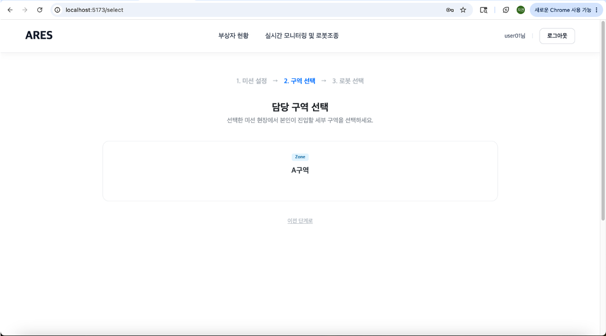

### 3. 로봇 선택

1. 선택한 구역에서 사용 가능한 로봇 목록이 표시됩니다.
2. 사용할 로봇을 선택합니다.

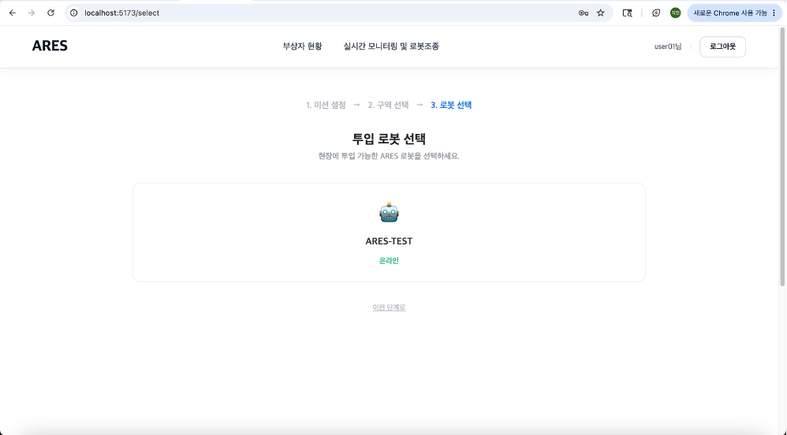

### 4. 메인 화면

미션, 구역, 로봇 선택이 완료되면 Operator 메인 화면으로 이동합니다.

#### 4-1. 부상자 지도

현장에서 감지된 부상자 위치가 지도 위에 표시됩니다.

> 📌 현재 API 연동 상태로 제공되며, 세부 마커 기능은 추후 업데이트 예정입니다.

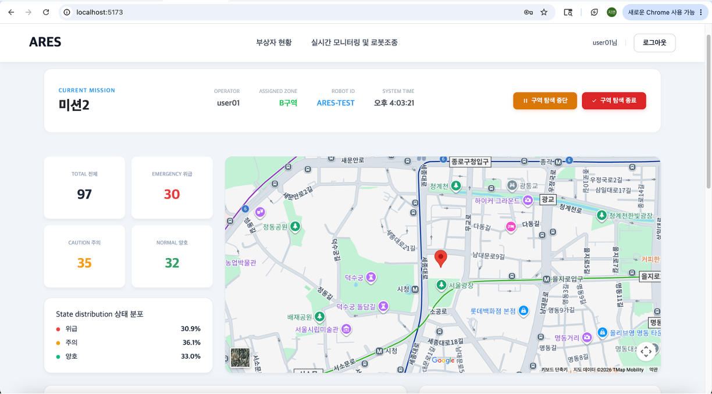

#### 4-2. 구역 중단

1. 메인 화면에서 **[구역 중단]** 버튼을 클릭합니다.
2. 확인 팝업이 표시되면 **[확인]** 을 클릭합니다.
3. 해당 구역의 로봇 작동이 일시 중단됩니다.

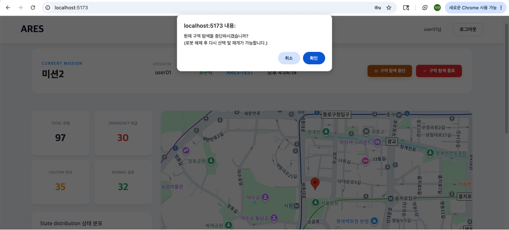

#### 4-3. 구역 종료

1. 메인 화면에서 **[구역 종료]** 버튼을 클릭합니다.
2. 확인 팝업이 표시되면 **[확인]** 을 클릭합니다.
3. 해당 구역 미션이 종료되고 결과가 저장됩니다.

> ⚠️ 구역 종료 후에는 해당 미션을 재개할 수 없습니다. 신중하게 클릭하세요.

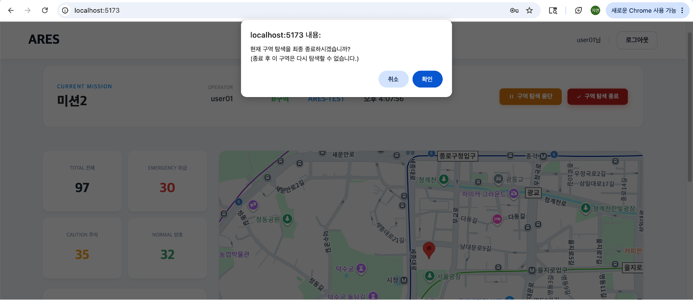

### 5. 실시간 모니터링 및 로봇조종 탭

상단 메뉴에서 **[실시간 모니터링 및 로봇조종]** 을 클릭하면 아래 기능을 사용할 수 있습니다.

#### 5-1. 로봇 조종

1. 모니터링 탭에서 조종 패널을 확인합니다.
2. 방향키를 사용하여 로봇을 조종합니다.


#### 5-2. 로봇 상태 확인

로봇의 배터리, 연결 상태, 현재 위치 등 실시간 상태 정보를 확인할 수 있습니다.


#### 5-3. 현장 상태 확인

현장 환경 정보와 로봇 카메라 피드를 실시간으로 확인할 수 있습니다.

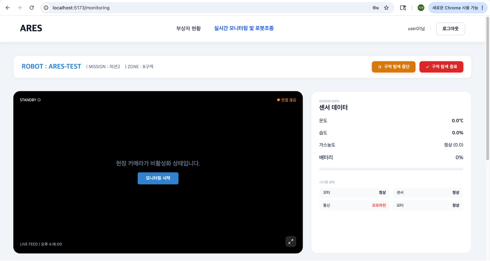

---

## 🔧 Admin 매뉴얼

Admin은 시스템 전반을 관리하는 역할입니다.  
로그인 후 미션 등록 및 관리 페이지로 바로 이동합니다.


### 1. 미션 관리

#### 1-1. 미션 등록

1. **[미션 등록]** 탭을 클릭합니다.
2. 미션 지역 및 미션 내용을 입력합니다.
3. **[등록]** 버튼을 클릭하여 등록을 완료합니다.

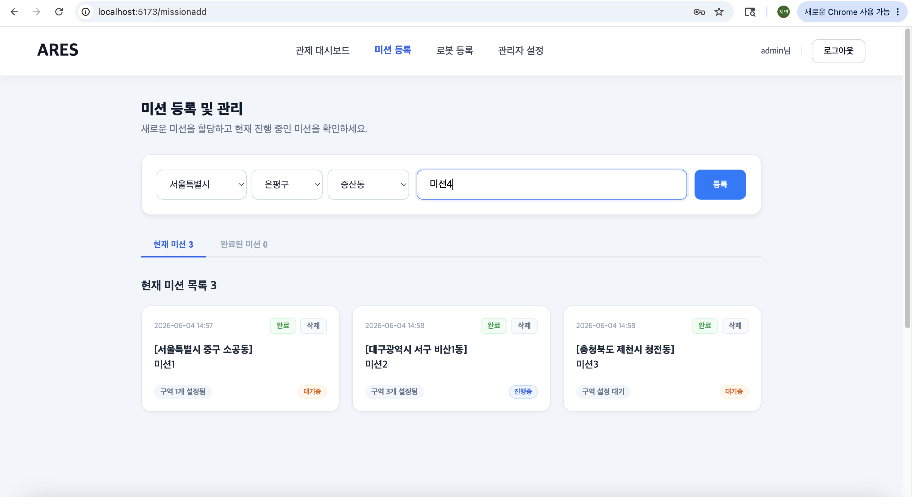

#### 1-2. 미션 구역 설정

1. 등록된 미션을 선택합니다.
2. 구역을 입력합니다.
3. **[설정]** 버튼을 클릭하여 구역 설정을 완료합니다.

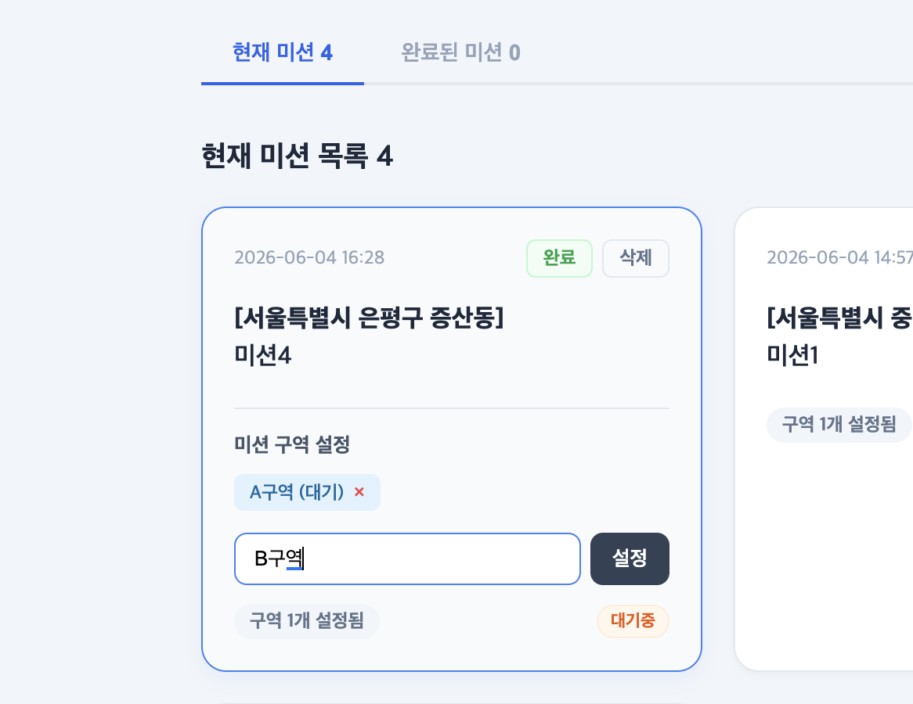

#### 1-3. 미션 완료 처리 및 삭제

- **완료 처리**: 해당 미션의 **[완료]** 버튼 클릭 → 확인 팝업에서 **[확인]** 클릭
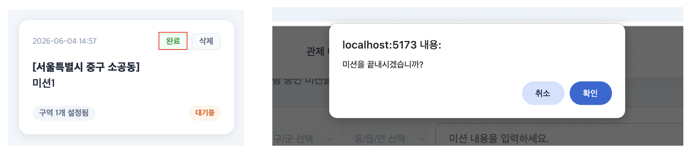

- **삭제**: 해당 미션의 **[삭제]** 버튼 클릭 → 확인 팝업에서 **[확인]** 클릭
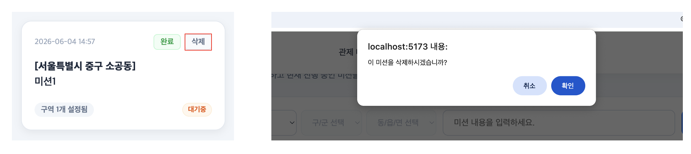

> ⚠️ 삭제된 미션 데이터는 복구할 수 없습니다.


### 2. 로봇 관리

#### 2-1. 로봇 등록

1. **[로봇 관리]** 탭에서 **[로봇 고유 식별 번호]** 를 입력합니다.
2. **[저장]** 버튼을 클릭하여 등록을 완료합니다.

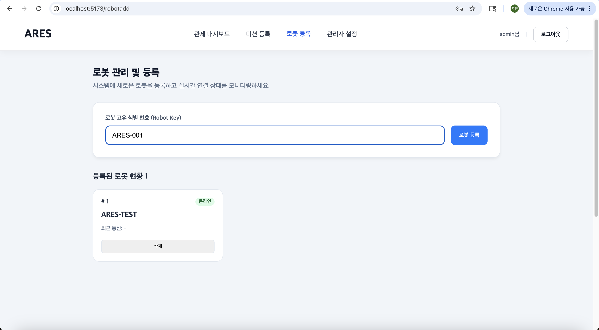

#### 2-2. 로봇 목록 삭제

- **삭제**: 해당 로봇 행의 **[삭제]** 버튼 클릭 → 확인 팝업에서 **[확인]** 클릭

> ⚠️ 삭제된 로봇 정보는 복구할 수 없습니다.

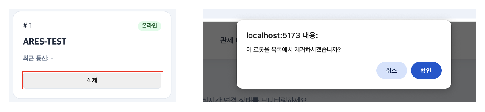

### 3. 사용자 관리

가입 요청한 사용자 목록을 확인하고 승인 또는 거절할 수 있습니다.

1. **[관리자 설정]** 탭으로 이동합니다.
2. 대기 중인 가입 요청 목록이 표시됩니다.
3. 각 요청에 대해 **[승인]** 또는 **[거절]** 버튼을 클릭합니다.
4. 승인된 사용자는 즉시 로그인이 가능해집니다.

> 📌 승인된 사용자 목록에서 역할(Admin/Operator) 및 상태를 확인할 수 있습니다.

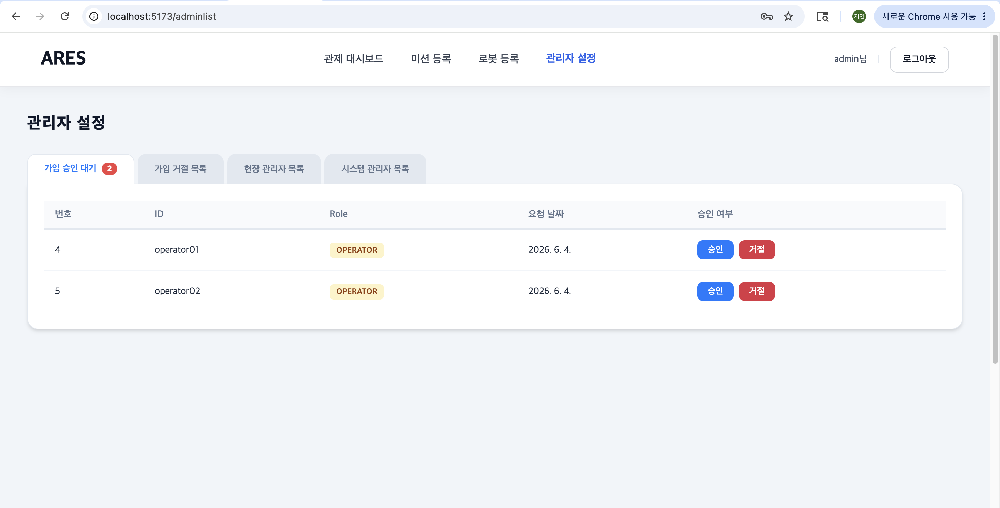

### 4. 전체 관제 대시보드

현재 실행 중인 모든 미션과 구역의 상태를 한눈에 확인할 수 있습니다.

#### 4-1. 실행 중인 미션 목록

진행 중인 미션 목록과 각 미션 구역의 상태가 표시됩니다.


#### 4-2. 미션 구역 스트리밍

1. 관제 대시보드에서 확인할 미션 또는 구역을 선택합니다.
2. 해당 구역의 실시간 스트리밍 화면이 표시됩니다.

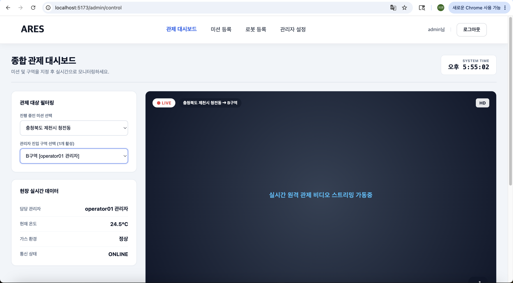

---
